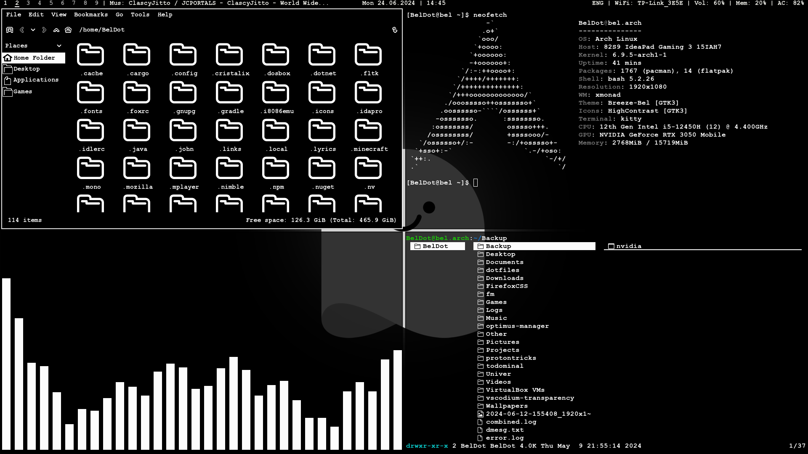

<h1>Dotfiles for my Arch Linux system. (readme WIP)</h1>

<h2>Packages</h2>
<bl>
  <li>xmonad</li>
  <li>xmonad-contrib</li>
  <li>xmobar</li>
  <li>picom</li>
  <li>feh</li>
  <li>rofi</li>
  <li>betterlockscreen</li>
  <li>lf</li>
  <li>dunst</li>
  <li>cava (optional)</li>
  <li>brillo and galculator for Fn keys to work (if you have them)</li>
  <li>neofetch (optional)</li>
  <li>vscodium (optional)</li>

  Note: you need to install xmonad and xmonad-contrib from the main git branch, not from a package manager.
</bl>
